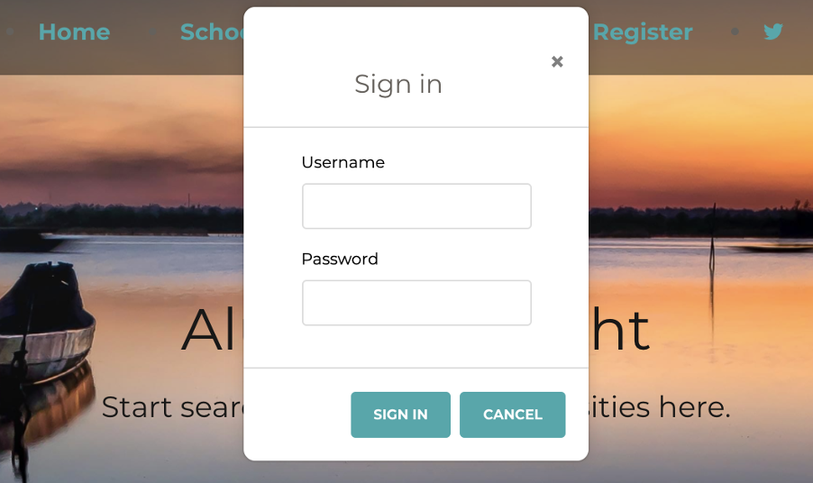
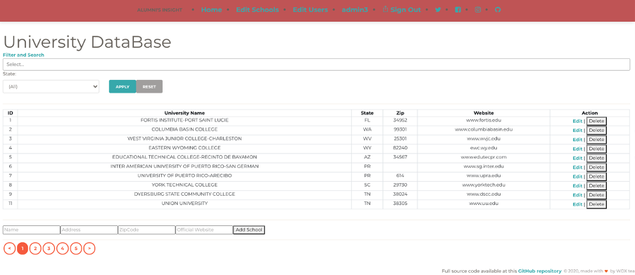
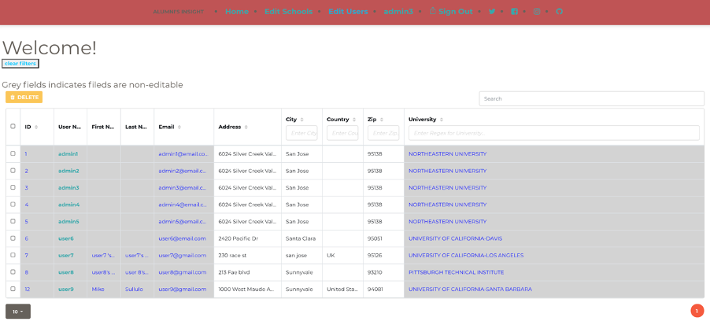
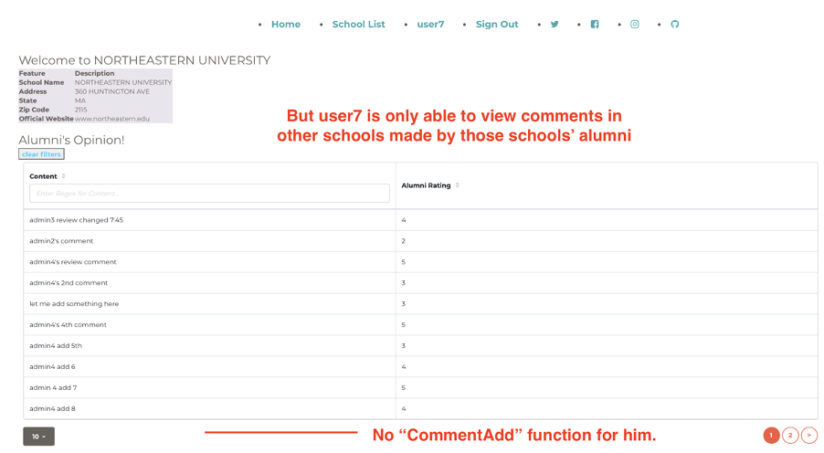
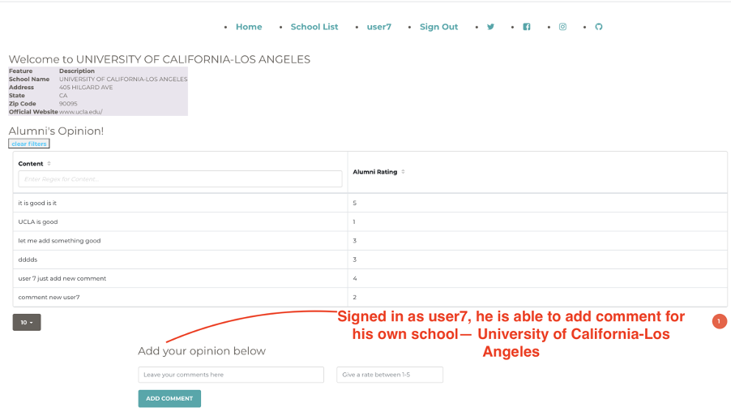
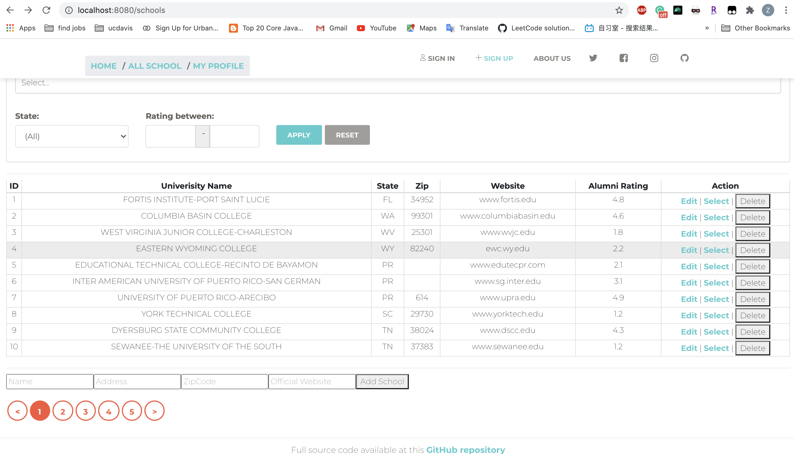
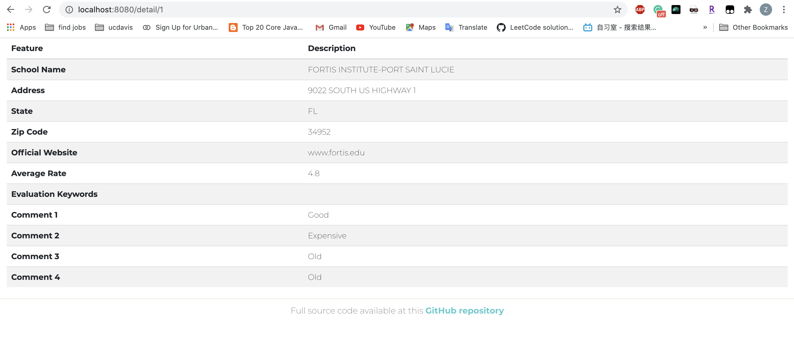
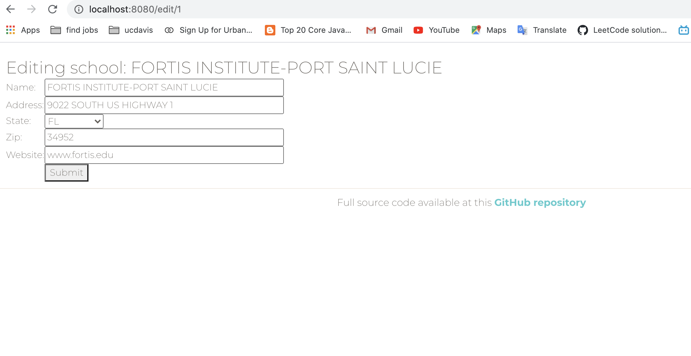

Group project UI by team : \
WDX Repo link to API: https://github.ccs.neu.edu/NEU-CS5610-SU20/GroupProject_WDX_API.git \
Heroku Link: https://alumnis-insight-ui.herokuapp.com

## Project Introduction and Development Progression:
Our App Alumni's Insight is designed for users to fetch the school evaluations from the school alumni. Our App structure is referred to our TextBook and IssueTracker APP.

### Iteration 3.0 (this includes all introductions of our APP)

Our website is intended to provide potential students with alumni opinions of a university. As a visitor, he could read basic university information and reviews from each university’s alumni. He might not be able to review any universities. This visitor role is implemented as non-registered users in our system. For university’s alumni, the user should first register with his associated university and other necessary information like email and password, then he would not only be able to view info from all universities, but also review (add comment and rating) for his own school. He is also able to update his personal information and previous comment he made through the “My profile” link once he is signed in. To manage these users, we have 5 special users, which are called as “admins” to manage users collection and also they are allowed to perform CRUD on school collection. 

Back-end involves graphQL fetching data from MongoDB. Front-end involves React, react bootstrap...etc package. As for front-end, pages like Home page, User profile page, School visit page...are designed intended for user viewing pleasure so CSS styling and bootstrap are involved. For school lists in admin mode, it was designed mainly for functional purposes.

For user interaction, 3 types of roles of users are involved and interact with each other. 

The 1st type is the admin user. As an admin user, he owns the right to edit basic school information in school databases, and other regular user’s personal information (except for email,  username and belonging university). As you could see below, the UI for admin user is made for functioning minimally. If he is signed in as admin user (username admin1, admin2, admin3, admin4 and admin5), as he is not interested in alumni's opinion, alumni’s comment input is not given here. For the user database, we currently only allow him to add basic user info but not to delete or add any user account. The user account is added to the user database when a new alumni user is registered. We also don’t allow the admin to modify the user's school, first name, and last name as these info should be claimed by alumni himself only. To perform edit, just click on the non-grey cell and the admin should be able to update the user's information.

The 2nd type of the user is alumni from a certain university. When he signed in and assigned himself a university, he may not change his university. He could view all universities' information from the school list. On the school list page made for user purpose, more sorting, filtering, selecting functions are made for user’s convenience. He could not, of course, edit or delete school but he could view detailed information by clicking one university’s name. He could see opinions (comments and ratings) from this university’s alumni. If he is the university’s alumni, he will be able to see the ‘add comment’ box. But when he is reviewing other universities, he could not add comment and rating to those, as universities are supposed to take opinions from alumni only. While he is log-in, he could also edit his own personal information. When he registers, his first name, last name...etc. was not provided, but he might change/add his first name, last name and other information here. He might also edit his own comment reviewed on his school. But for the first comment, he needs to go to the university page to leave a new comment there. For the example below, user7 (password:user7) is able to review comments from Northeastern University, but he could only see ‘add comment’ for his own university, which is University of California-Los Angeles as you could see from his profile by clicking the “user7”  link.  

The 3rd type of user is visitors, which doesn’t require log-in. He is able to view all information as 2nd type of user (alumni), but he could not leave a comment to any universities and he didn’t have a ‘My Profile' link for him to edit his information.

#### Test accounts
Current registered users:(You may test from registration to add a new user starting from registration page, or you may sign in as an existing user)

**Username** | **Password** | **University**
--- | --- | ---
admin1 | admin1 | NORTHEASTERN UNIVERSITY
admin2 | admin2 | NORTHEASTERN UNIVERSITY
admin3 | admin3 | NORTHEASTERN UNIVERSITY
admin4 | admin4 | NORTHEASTERN UNIVERSITY
admin5 | admin5 | NORTHEASTERN UNIVERSITY
user6 | user6 | UNIVERSITY OF CALIFORNIA-DAVIS
user7 | user7 | UNIVERSITY OF CALIFORNIA-LOS ANGELES
user8 | user8 | PITTSBURGH TECHNICAL INSTITUTE
user9 | user9 | UNIVERSITY OF CALIFORNIA-SANTA BARBARA
user10 | user10 | BANCROFT SCHOOL OF MASSAGE THERAPY
user11 | user11 | LORAIN COUNTY JOINT VOCATIONAL SCHOOL DISTRICT
user100 | user100 | NORTHEASTERN JUNIOR COLLEGE
user45 | user45 | UNIVERSITY OF SAN DIEGO

#### Members contribution
Member: Mi Tang

Main contributions:
1. Develop school table which is accessible by visitors and user table which is accessible by admin users. Implemented select, edit, filtering, sorting, searching function on these two tables. Update user collection with “edit” function.
2. Design and implemented alumni(normal registered user) review system on `SchoolDetail` page (/detail/:id). A registered user could review and only review his own university. Other visitors could read reviews from all universities but were not able to review them.
  - Fetch schoolID from current schoolList so comments for the specific school are shown to everyone. Query on school information based on this schoolID and render the view.
  - Fetch userID and schoolID from login status of a specific user so to verify if he is qualified to review this specific school. If he is qualified, fetch commentID from comment collection so to perform “commentADD” function and schoolID, userID also gets written in comment collection. If he is not qualified, “commentADD” function is not accessible to him. First query on current user information based on userID, then update user collection and comment collection if an “updated” button is hit.
3. Design and implement a user profile update system on “UserProfilePage” (/user/:id). Users would be able to update their personal profile and comment he made to his university on the same page. Fetch API and update data process is similar to 2.
	
4. Complete UI front-end design with most pages with various packages imported: react-bootstrap, react-bootstrap-table, css-style...etc for user viewing pleasure. Apply react hooks in class components to use state and features in these pages. 

Member: Zihan Xiao

Main contributions:
1.	Developed user register, login and logout function. The authentication is implemented by JWT token and the login status remains through storing the token in the browser local storage. 
2.	Implemented Identity and Access Management (IAM) with the user id. That is: 
   - Admins, who have user id from 1 to 5, can access all functionality, and write all databases in our app.
   - Ordinary users, who have user-id larger than 5, can evaluate their schools but edit schools and the user database. They can also modify their personal information except their username, registration email and their school.
   - Visitors, the customers not signing in, can only browse the schools information and search the details as well as the comments of their target schools.
3.	Used Python to do data preprocessing, and constructed the database by MongoDB Altas, and developed the data fetching API at the back-end.
4.	Implemented some front-end pages, including: 
   - school list page at the admin mode, searching, adding and deleting functionalities for schools.
   - School Details page and School Edit page at the admin mode.

#### References
1.	Database: https://data.opendatasoft.com/explore/dataset/us-colleges-and-universities%40public-us/information/?sort=population
2.	Textbook: Pro MERN Stack Full Stack Web App Development with Mongo, Express, React, and Node by Vasan Subramanian.
3.	Authentication function is referred from https://github.com/hidjou/classsed-graphql-mern-apollo/tree/master
4.	React bootstrap package and UI design is referred from
https://www.creative-tim.com/product/paper-kit-react
5.	Table function is referred from 
http://allenfang.github.io/react-bootstrap-table/

### Iteration 2.0
This week we implemented App Register/login, user profile and comments management. 
1. After registration, user can login and maintain his "signIn" state for an hour. The jwt token is stored in local storage and will be expired after an hour.
2. Create a new collection to manage user comments.
3. User can fetch his personal information, update his personal information and see his comments history.
4. Heroku ui: https://new-app-ui1.herokuapp.com.

### Iteration 1.0
The App pages and functions include:
- Home landing page

- User registration/log in (will be implemented at Iteration 2.0)
- User profile (will be implemented at Iteration 2.0)
- School list page with search and filter functionalities (Done)

- School details (Done)

- School Information Edit (Done)

- School Evaluation, including rating and write comments (Partially done, api has been established. Will be achieved at Iteration 2.0)

## Team Member:
Mi Tang, Zihan Xiao\
Member contributions can be find in Dev logs.

## APP UI Installation and running instruction
1. Installation: under ui work directory, run `npm install`.
2. Running: run `npm run compile` then `npm start`. App will be run at http://localhost:8080 .

## Development logs
Aug 12 by Zihan
1. Final test and fix minor bugs.
2. Deploy to Heroku.

Aug 12 by Mi Tang
1. Final test and fix minor bugs.

Aug 10 by Zihan
1. Modify ui design.
2. Change alert method and abort Toast.
3. Deploy App to heroku.

Aug 10 by Mi Tang
1. Admin navbar and user navbar conflicts solved.
2. Heroku deployment trial.

Aug 9 by Zihan
1. Implemented access authorization management.
2. Fix navigation bar errors.

Aug 9 by Mi Tang
1. Sucessfully use login state to control rendering of userprofile page, and user will be able to update his comment and personal info.
2. Complete comment add part, when user add new comment to school, comment database records both userID and schoolID, so user could view his submitted comment from his profile.

Aug 8 by Mi Tang
1. User database update function implemented. Only admin could update user database.

Aug 7 by Mi Tang
1. Set PORT so codes work both for heroku and local.

Aug 6 by MiTang
1. Impelemented user profile update function (8080/profile/$(id)) including updating personal info and school review info, with manually setting userID and schoolID. Will continue on get userID from login information.
Aug 5 By MiTang
1. Fixed function to show comments only related with school on school detail page.
2. Use react-bootstrap to pretify comment submit interface.

Aug 4 By MiTang
1. Redefined comment databases, school databases and user databases along with graphql schema to relate commentID to schoolID and userID.
2. Implemented add comment function to related school under school detail page. Comment is able to added to specific schools but not identified as specific user yet. 
3. Each school detail page nows shows a full-list of comments. Need to show only related comments. Will continue to do. 

Aug 3 By Zihan
1. Implemented Auth, JWT authentication and register functionality.

August 3rd by MiTang
1. Buildup Admin page login and to connect with Users database, comment databases and university databases.

August 2nd by MiTang

1. Seprate visitor page and admin page for school list. Visitor page are only allowed to view and click for detail information. Filters, hide view, sorting and search functions all supplied. Admin page for school list has access to edit, delete and add schools, but view detail function is not necessry so is canceled.
2. Fixed connection links between navigation and pages.

August 1st by MiTang
1. `npm install react-bootstrap-table` Build SchoolVisitPage with react-bootstrap-table for non-admin user visit

July 31 By Zihan
1. Correct bugs in filter.

July 30 by Zihan
1. Correct StateType in SchoolAdd.
2. Update comments display in SchoolDetails.

July 29, 2020 by Mi Tang
1. Pretify UI by modifying bootstrap property
2. Home, All School, My Profile link connected.
3. 'State' filter applied.
4. Modified webpack config to get rid of warnings.
5. npm install -D @svgr/webpack to show icon
6. Changed package.json,
7. npm install --save-dev style-loader css-loader

July 29, 2020 by Zihan
1. Finished SchoolEdit.jsx. Modified SchoolAdd.jsx and SchoolSearch.jsx.
2. Add plugin in webpack.config.js
3. Corrected table head in SchoolList Page.

July 28, 2020 by Mi Tang
1. `npm install file-loader --save-dev ` to allow webpack read jpg files
2. `npm install gulp --save-dev` to use gulp
3. `npm install gulp-sass --save-dev` to use sass
4.  Remove server rendering, follows layout of Pro-MERN-Stack chap11.

July 27, 2020 by Zihan
1. There exist some problems in router. For example, when click "select" in school list page, the page redirect to "localhost:<port>/detail/id" but the school detail data does not return as expect (which return "School ${id} dose not found). However, if refresh that page, school description shows as expected.
2. Similar problems shows when click "Back Button" in the browser.